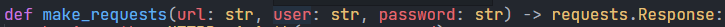

# Answers

1. How long did you spend on the coding test? What would you add to your solution if you had more
time? If you didn't spend much time on the coding test then use this as an opportunity to explain what
you would add.

It took me about 20-40 minutes to complete the code, after that, the test where done in half an hour. A functionality I would have liked to add is to have used a .env file to save the username and password values hardcoded in the test file in order to improve security. I would also add a settings file for variables such as the API url.

2. What was the most useful feature added to the latest version of your chosen language? Please include
a snippet of code that shows how you've used it.

Without a doubt, the most useful features of Python 11 were the speed improvement (now it is in average 25% faster) and the error messages (since now it points directly to the exact expression causing the error instead of just the line).

I would also like to mention the fact that thanks to the overall improvement of Python, it is no longer necessary to import the typing library for most of the standard library types.

3. How would you track down a performance issue in production? Have you ever had to do this?

Although I have never encountered this issue, I would track them down by running load tests that simulate production-level traffic on the development-stage application. I would use protocol-based load tests for testing APIs' performance and browser-based load tests for the client side.

4. How would you improve the Lantek API that you just used?

After testing the API for a bit, I noticed that the body of the 401 error is empty for every case (wrong user, password or empty auth header). I would add more information in the body, in order for the user to get more data. 